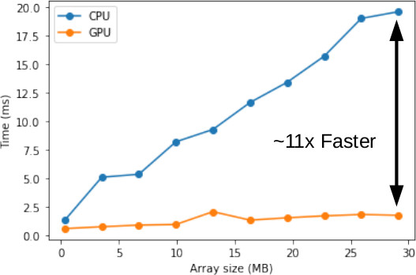

<h1 align='center'> PyRSVD - Accelerated Randomised SVD in Python</h1>

Perform fast rSVD accelerated using the CUDA, all in Python.

## Install

Install from source into a Conda/Miniconda environment.

```bash
git clone git@github.com:skailasa/pyrsvd.git
cd pyrsvd

conda build conda.recipe
conda install --use-local pyrsvd
```

## Usage

```python
import numpy as np

import pyrsvd

# Instantiate a 'tall' and 'thin' matrix to compress
M = 123
N = 45
A = np.random.rand(M, N)

# Choose a target rank
K = 5

u, s, vt = pyrsvd.svd(A, K)
```

## Benchmark

Benchmarked for 'thin' and 'tall' matrices, versus NumPy implementation on a 8th generation Inel i7 CPU and an NVidia Quadro RTX 3000 Mobile GPU, including data transfer times. Obviiously performance will be improved when running directly on GPU data!

### 1) Dense Matrix

<p style="text-align:center;">

</p>


## References

[1] Halko, N., Martinsson, P. G., & Tropp, J. A. (2011). Finding structure with randomness: Probabilistic algorithms for constructing approximate matrix decompositions. SIAM review, 53(2), 217-288.
